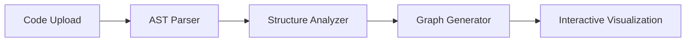

# 🔍 CodeLens: Python Codebase Visualizer
> Transform any Python codebase into an interactive visual map within seconds. Powered by AST, NetworkX, and PyVis.

[](https://www.python.org/downloads/)
[](https://streamlit.io)
[](https://opensource.org/licenses/MIT)
[](http://makeapullrequest.com)

## ✨ Overview

CodeLens helps you understand complex Python projects at a glance. Simply upload your codebase, and watch as it transforms into an interactive visualization of classes, functions, and their relationships.

### 🚀 Key Features

- **Instant Analysis**: Upload any Python project as ZIP and get immediate insights
- **Deep Understanding**: Automatically maps all classes and function relationships
- **Interactive Exploration**: Navigate through your codebase visually
- **Zero Configuration**: No setup required - just upload and explore

## 🎮 Live Demo

Experience CodeLens in action: [Try the Live Demo](https://your-streamlit-link.streamlit.app)


## 🛠️ Technology Stack

- **Core Engine**: Python 3.9+
- **Code Analysis**: Abstract Syntax Trees (AST)
- **Graph Processing**: NetworkX
- **Visualization**: PyVis
- **User Interface**: Streamlit

## 🔄 Architecture



## 💻 Quick Start

1. **Clone & Navigate**
```bash
git clone https://github.com/yourusername/codelens.git
cd codelens
```

2. **Setup Environment**
```bash
python -m venv venv
# Windows
venv\Scripts\activate
# Unix/MacOS
source venv/bin/activate
pip install -r requirements.txt
```

3. **Launch Application**
```bash
streamlit run app.py
```

## 📁 Project Structure
```
codelens/
├── app.py              # Main Streamlit application
├── parser/
│   └── code_parser.py  # AST parsing logic
├── visualizer/
│   └── graph_builder.py # Graph generation
├── templates/
│   └── code_graph.html # Visualization template
├── requirements.txt    # Dependencies
└── README.md          # Documentation
```

## 🤝 Contributing

Contributions are welcome! Feel free to:
- Open issues for bugs or enhancements
- Submit pull requests
- Improve documentation
- Share feedback

## 📜 License

This project is licensed under the MIT License - see the [LICENSE](LICENSE) file for details.

---

<p align="center">
Made with ❤️ for the Python community
</p>